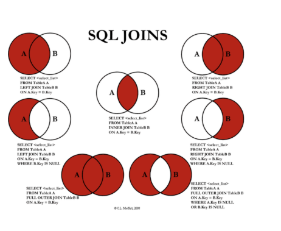

# 1. 없어진 기록 찾기

**문제 설명**

ANIMAL_INS 테이블은 동물 보호소에 들어온 동물의 정보를 담은 테이블입니다. ANIMAL_INS 테이블 구조는 다음과 같으며, ANIMAL_ID, ANIMAL_TYPE, DATETIME, INTAKE_CONDITION, NAME, SEX_UPON_INTAKE는 각각 동물의 아이디, 생물 종, 보호 시작일, 보호 시작 시 상태, 이름, 성별 및 중성화 여부를 나타냅니다.

| NAME             | TYPE       | NULLABLE |
| ---------------- | ---------- | -------- |
| ANIMAL_ID        | VARCHAR(N) | FALSE    |
| ANIMAL_TYPE      | VARCHAR(N) | FALSE    |
| DATETIME         | DATETIME   | FALSE    |
| INTAKE_CONDITION | VARCHAR(N) | FALSE    |
| NAME             | VARCHAR(N) | TRUE     |
| SEX_UPON_INTAKE  | VARCHAR(N) | FALSE    |

ANIMAL_OUTS 테이블은 동물 보호소에서 입양 보낸 동물의 정보를 담은 테이블입니다. ANIMAL_OUTS 테이블 구조는 다음과 같으며, ANIMAL_ID, ANIMAL_TYPE, DATETIME, NAME, SEX_UPON_OUTCOME는 각각 동물의 아이디, 생물 종, 입양일, 이름, 성별 및 중성화 여부를 나타냅니다. ANIMAL_OUTS 테이블의 ANIMAL_ID는 ANIMAL_INS의 ANIMAL_ID의 외래 키입니다.

| NAME             | TYPE       | NULLABLE |
| ---------------- | ---------- | -------- |
| ANIMAL_ID        | VARCHAR(N) | FALSE    |
| ANIMAL_TYPE      | VARCHAR(N) | FALSE    |
| DATETIME         | DATETIME   | FALSE    |
| NAME             | VARCHAR(N) | TRUE     |
| SEX_UPON_OUTCOME | VARCHAR(N) | FALSE    |

천재지변으로 인해 일부 데이터가 유실되었습니다. 입양을 간 기록은 있는데, 보호소에 들어온 기록이 없는 동물의 ID와 이름을 ID 순으로 조회하는 SQL문을 작성해주세요.

예시

예를 들어, ANIMAL_INS 테이블과 ANIMAL_OUTS 테이블이 다음과 같다면

ANIMAL_INS

| ANIMAL_ID | ANIMAL_TYPE | DATETIME            | INTAKE_CONDITION | NAME | SEX_UPON_INTAKE |
| --------- | ----------- | ------------------- | ---------------- | ---- | --------------- |
| A352713   | Cat         | 2017-04-13 16:29:00 | Normal           | Gia  | Spayed Female   |
| A350375   | Cat         | 2017-03-06 15:01:00 | Normal           | Meo  | Neutered Male   |

ANIMAL_OUTS

| ANIMAL_ID | ANIMAL_TYPE | DATETIME            | NAME  | SEX_UPON_OUTCOME |
| --------- | ----------- | ------------------- | ----- | ---------------- |
| A349733   | Dog         | 2017-09-27 19:09:00 | Allie | Spayed Female    |
| A352713   | Cat         | 2017-04-25 12:25:00 | Gia   | Spayed Female    |
| A349990   | Cat         | 2018-02-02 14:18:00 | Spice | Spayed Female    |

ANIMAL_OUTS 테이블에서

- Allie의 ID는 ANIMAL_INS에 없으므로, Allie의 데이터는 유실되었습니다.
- Gia의 ID는 ANIMAL_INS에 있으므로, Gia의 데이터는 유실되지 않았습니다.
- Spice의 ID는 ANIMAL_INS에 없으므로, Spice의 데이터는 유실되었습니다.

따라서 SQL문을 실행하면 다음과 같이 나와야 합니다.

| ANIMAL_ID | NAME  |
| --------- | ----- |
| A349733   | Allie |
| A349990   | Spice |


## sol1)

**ANIMAL_OUTS 테이블에는 있는데, ANIMAL_INS 테이블에는 없는** 동물들의 ID와 이름을 조회해야 합니다.

------

- 등장하는 개념
  - JOIN, LEFT OUTER JOIN

------

## **JOIN 의 활용**

JOIN은 두 테이블의 데이터를 **일정한 조건에 의해 연결하여 마치 하나의 테이블처럼 만드는 것**으로 볼 수 있습니다.

주로 많이 쓰이는 것으로 INNER JOIN과 LEFT OUTER JOIN을 들 수 있습니다.

------

### **LEFT OUTER JOIN**


- 위 그림처럼 두 테이블이 존재한다고 가정해 보겠습니다.
- **두 테이블의 JOB 이 같은 것을 기준으로 LEFT OUTER JOIN을 진행합니다.**
- LEFT OUTER JOIN은 왼쪽에 오는 테이블을 기준으로, 오른쪽에 오는 테이블과 비교하여 조건에 맞는 값이 있으면 JOIN하여 가져오고, 값이 없으면 null 값을 표시합니다.
- 즉 LEFT OUTER JOIN은 이처럼 JOIN 문을 수행할 때, 왼**쪽에 있는 데이터는 무조건 가져오며, 오른쪽에 오는 테이블과 JOIN을 수행하여 조건에 맞는 데이터가 없을 시 null 로 표시**하게 됩니다.
- 위의 그림에 나온 결과표를 참고해 주세요.
  - **TABLE_ONE**에 있는 **aaa**는 **JOB 이 student** 입니다.
  - TABLE_TWO 에 JOB이 student 인 값들과 LEFT OUTER JOIN이 수행되어 모두 연결이 됩니다.
  - 하지만 **TABLE_ONE**에 **ddd**는 **JOB이 athlete** 이지만, **TABLE_TWO 에는 JOB이 athlete 인 데이터가 없습니다.**
  - 그러므로 LEFT OUTER JOIN을 수행하면, 왼쪽 테이블의 데이터인 ddd는 결과에도 무조건 표시되지만, **오른쪽 테이블에 같이 연결할 데이터가 없으므로 NULL 값을 표시**하게 됩니다.

------

**LEFT OUTER JOIN**을 활용하여 문제를 풀 수 있습니다.

문제에서는, **입양을 간 기록(ANIMAL_OUTS)** 은 **있지만**, **들어온 기록(ANIMAL_INS) 은 없는** 데이터를 조회해야 합니다.

LEFT OUTER JOIN을 어떻게 사용하면 될까요?

- **입양을 간 기록은 존재**한다고 하였으므로, JOIN 결과에는 ANIMAL_OUTS 데이터가 무조건 나오게 해야 할 것입니다. 따라서 JOIN 문 왼쪽에 ANIMAL_OUTS 테이블이 와야 할 것입니다.
- ANIMAL_OUTS 와 ANIMAL_INS 를 **ANIMAL_ID가 같은 것을 기준으로 LEFT OUTER JOIN** 하면,
  - ANIMAL_OUTS 테이블에 존재하는 ANIMAL_ID와, 그 ANIMAL_ID와 같은 ANIMAL_INS 테이블의 데이터가 옆에 같이 연결될 것입니다.
  - 그러나 **ANIMAL_ID가 같은 값이 ANIMAL_INS 테이블에 존재하지 않는다면, NULL 값으로 연결**될 것입니다.
  - 이를 통해, ANIMAL_OUTS 에는 있지만 ANIMAL_INS에는 없는 ANIMAL_ID 의 값을 조회할 수 있게 됩니다.

```mysql
 SELECT OUTS.ANIMAL_ID, OUTS.NAME 
 FROM ANIMAL_OUTS OUTS LEFT OUTER JOIN ANIMAL_INS INS ON OUTS.ANIMAL_ID = INS.ANIMAL_ID 
 WHERE INS.ANIMAL_ID is NULL 
 ORDER BY OUTS.ANIMAL_ID 
```

- **오른쪽에 연결될 INS의 자료가 null 인 것으로부터(where 조건 참조) 찾을 수 있습니다.**


----

## sol2)

```mysql
SELECT b.ANIMAL_ID, b.NAME
FROM ANIMAL_INS a RIGHT JOIN ANIMAL_OUTS b ON a.ANIMAL_ID = b.ANIMAL_ID
WHERE a.ANIMAL_ID IS NULL
ORDER BY ANIMAL_ID;
```

\* RIGHT JOIN

오른쪽 테이블을 기준으로 왼쪽 테이블을 조인

완쪽에 일치하는 레코드가 없으면 오른쪽에서는 결과가 NULL이 됨




## 오라클 풀이 

ANIMAL_OUTS 테이블의 데이터 중 ANIMAL_INS에 없는 데이터를 조회합니다.

### sol1) NOT EXISTS 활용

- ANIMAL_OUTS 테이블에 NOT EXISTS문을 적용합니다.
- ID 순으로 정렬합니다.

```sql
SELECT O.ANIMAL_ID, O.NAME
  FROM ANIMAL_OUTS O
 WHERE NOT EXISTS (SELECT 1
                     FROM ANIMAL_INS I
                    WHERE I.ANIMAL_ID = O.ANIMAL_ID
                  )
 ORDER BY ANIMAL_ID
;
```


### sol2) OUTER JOIN, IS NULL 활용

- ANIMAL_OUTS과 ANIMAL_INS를 OUTER JOIN하고,
- ANIMAL_INS의 키에 IS NULL 조건을 걸어줍니다.
- ID 순으로 정렬합니다.

````sql
SELECT O.ANIMAL_ID, O.NAME
  FROM ANIMAL_OUTS O
     , ANIMAL_INS  I
 WHERE O.ANIMAL_ID = I.ANIMAL_ID(+)
   AND I.ANIMAL_ID IS NULL
 ORDER BY ANIMAL_ID
;
````


----

----

# 2.있었는데요 없었습니다.

**문제 설명**

ANIMAL_INS 테이블은 동물 보호소에 들어온 동물의 정보를 담은 테이블입니다. ANIMAL_INS 테이블 구조는 다음과 같으며, ANIMAL_ID, ANIMAL_TYPE, DATETIME, INTAKE_CONDITION, NAME, SEX_UPON_INTAKE는 각각 동물의 아이디, 생물 종, 보호 시작일, 보호 시작 시 상태, 이름, 성별 및 중성화 여부를 나타냅니다.

| NAME             | TYPE       | NULLABLE |
| ---------------- | ---------- | -------- |
| ANIMAL_ID        | VARCHAR(N) | FALSE    |
| ANIMAL_TYPE      | VARCHAR(N) | FALSE    |
| DATETIME         | DATETIME   | FALSE    |
| INTAKE_CONDITION | VARCHAR(N) | FALSE    |
| NAME             | VARCHAR(N) | TRUE     |
| SEX_UPON_INTAKE  | VARCHAR(N) | FALSE    |

ANIMAL_OUTS 테이블은 동물 보호소에서 입양 보낸 동물의 정보를 담은 테이블입니다. ANIMAL_OUTS 테이블 구조는 다음과 같으며, ANIMAL_ID, ANIMAL_TYPE, DATETIME, NAME, SEX_UPON_OUTCOME는 각각 동물의 아이디, 생물 종, 입양일, 이름, 성별 및 중성화 여부를 나타냅니다. ANIMAL_OUTS 테이블의 ANIMAL_ID는 ANIMAL_INS의 ANIMAL_ID의 외래 키입니다.

| NAME             | TYPE       | NULLABLE |
| ---------------- | ---------- | -------- |
| ANIMAL_ID        | VARCHAR(N) | FALSE    |
| ANIMAL_TYPE      | VARCHAR(N) | FALSE    |
| DATETIME         | DATETIME   | FALSE    |
| NAME             | VARCHAR(N) | TRUE     |
| SEX_UPON_OUTCOME | VARCHAR(N) | FALSE    |

관리자의 실수로 일부 동물의 입양일이 잘못 입력되었습니다. 보호 시작일보다 입양일이 더 빠른 동물의 아이디와 이름을 조회하는 SQL문을 작성해주세요. 이때 결과는 보호 시작일이 빠른 순으로 조회해야합니다.

예시

예를 들어, ANIMAL_INS 테이블과 ANIMAL_OUTS 테이블이 다음과 같다면

ANIMAL_INS

| ANIMAL_ID | ANIMAL_TYPE | DATETIME            | INTAKE_CONDITION | NAME     | SEX_UPON_INTAKE |
| --------- | ----------- | ------------------- | ---------------- | -------- | --------------- |
| A350276   | Cat         | 2017-08-13 13:50:00 | Normal           | Jewel    | Spayed Female   |
| A381217   | Dog         | 2017-07-08 09:41:00 | Sick             | Cherokee | Neutered Male   |

ANIMAL_OUTS

| ANIMAL_ID | ANIMAL_TYPE | DATETIME            | NAME     | SEX_UPON_OUTCOME |
| --------- | ----------- | ------------------- | -------- | ---------------- |
| A350276   | Cat         | 2018-01-28 17:51:00 | Jewel    | Spayed Female    |
| A381217   | Dog         | 2017-06-09 18:51:00 | Cherokee | Neutered Male    |

SQL문을 실행하면 다음과 같이 나와야 합니다.

| ANIMAL_ID | NAME     |
| --------- | -------- |
| A381217   | Cherokee |


## sol)

```mysql
-- 코드를 입력하세요
SELECT INS.ANIMAL_ID, INS.NAME
FROM ANIMAL_INS INS
LEFT JOIN ANIMAL_OUTS  OUTS 
ON INS.ANIMAL_ID = OUTS.ANIMAL_ID
WHERE INS.DATETIME > OUTS.DATETIME
ORDER BY INS.DATETIME
```


## 오라클 풀이

보호시작일보다 입양일이 빠른 동물을 조회합니다.

- ANIMAL_INS와 ANIMAL_OUT을 INNER JOIN하고,
- 보호시작일 > 입양일 조건을 걸어줍니다.
- 보호시작일 순으로 정렬합니다.

````SQL
SELECT I.ANIMAL_ID, I.NAME
  FROM ANIMAL_INS  I 
     , ANIMAL_OUTS O
 WHERE I.ANIMAL_ID = O.ANIMAL_ID
   AND I.DATETIME > O.DATETIME
 ORDER BY I.DATETIME
````


----

# 3. 오랜기간 보호한 동물(1)


**문제 설명**

ANIMAL_INS 테이블은 동물 보호소에 들어온 동물의 정보를 담은 테이블입니다. ANIMAL_INS 테이블 구조는 다음과 같으며, ANIMAL_ID, ANIMAL_TYPE, DATETIME, INTAKE_CONDITION, NAME, SEX_UPON_INTAKE는 각각 동물의 아이디, 생물 종, 보호 시작일, 보호 시작 시 상태, 이름, 성별 및 중성화 여부를 나타냅니다.

| NAME             | TYPE       | NULLABLE |
| ---------------- | ---------- | -------- |
| ANIMAL_ID        | VARCHAR(N) | FALSE    |
| ANIMAL_TYPE      | VARCHAR(N) | FALSE    |
| DATETIME         | DATETIME   | FALSE    |
| INTAKE_CONDITION | VARCHAR(N) | FALSE    |
| NAME             | VARCHAR(N) | TRUE     |
| SEX_UPON_INTAKE  | VARCHAR(N) | FALSE    |

ANIMAL_OUTS 테이블은 동물 보호소에서 입양 보낸 동물의 정보를 담은 테이블입니다. ANIMAL_OUTS 테이블 구조는 다음과 같으며, ANIMAL_ID, ANIMAL_TYPE, DATETIME, NAME, SEX_UPON_OUTCOME는 각각 동물의 아이디, 생물 종, 입양일, 이름, 성별 및 중성화 여부를 나타냅니다. ANIMAL_OUTS 테이블의 ANIMAL_ID는 ANIMAL_INS의 ANIMAL_ID의 외래 키입니다.

| NAME             | TYPE       | NULLABLE |
| ---------------- | ---------- | -------- |
| ANIMAL_ID        | VARCHAR(N) | FALSE    |
| ANIMAL_TYPE      | VARCHAR(N) | FALSE    |
| DATETIME         | DATETIME   | FALSE    |
| NAME             | VARCHAR(N) | TRUE     |
| SEX_UPON_OUTCOME | VARCHAR(N) | FALSE    |

아직 입양을 못 간 동물 중, 가장 오래 보호소에 있었던 동물 3마리의 이름과 보호 시작일을 조회하는 SQL문을 작성해주세요. 이때 결과는 보호 시작일 순으로 조회해야 합니다.

예시

예를 들어, ANIMAL_INS 테이블과 ANIMAL_OUTS 테이블이 다음과 같다면

ANIMAL_INS

| ANIMAL_ID | ANIMAL_TYPE | DATETIME            | INTAKE_CONDITION | NAME          | SEX_UPON_INTAKE |
| --------- | ----------- | ------------------- | ---------------- | ------------- | --------------- |
| A354597   | Cat         | 2014-05-02 12:16:00 | Normal           | Ariel         | Spayed Female   |
| A373687   | Dog         | 2014-03-20 12:31:00 | Normal           | Rosie         | Spayed Female   |
| A412697   | Dog         | 2016-01-03 16:25:00 | Normal           | Jackie        | Neutered Male   |
| A413789   | Dog         | 2016-04-19 13:28:00 | Normal           | Benji         | Spayed Female   |
| A414198   | Dog         | 2015-01-29 15:01:00 | Normal           | Shelly        | Spayed Female   |
| A368930   | Dog         | 2014-06-08 13:20:00 | Normal           | Spayed Female |                 |

ANIMAL_OUTS

| ANIMAL_ID | ANIMAL_TYPE | DATETIME            | NAME          | SEX_UPON_OUTCOME |
| --------- | ----------- | ------------------- | ------------- | ---------------- |
| A354597   | Cat         | 2014-05-02 12:16:00 | Ariel         | Spayed Female    |
| A373687   | Dog         | 2014-03-20 12:31:00 | Rosie         | Spayed Female    |
| A368930   | Dog         | 2014-06-13 15:52:00 | Spayed Female |                  |

SQL문을 실행하면 다음과 같이 나와야 합니다.

| NAME   | DATETIME            |
| ------ | ------------------- |
| Shelly | 2015-01-29 15:01:00 |
| Jackie | 2016-01-03 16:25:00 |
| Benji  | 2016-04-19 13:28:00 |

※ 입양을 가지 못한 동물이 3마리 이상인 경우만 입력으로 주어집니다.

## sol)

```mysql
SELECT A.NAME, A.DATETIME 
FROM ANIMAL_INS A
LEFT JOIN ANIMAL_OUTS B
ON A.ANIMAL_ID = B.ANIMAL_ID
WHERE B.ANIMAL_ID IS NULL
ORDER BY A.DATETIME
LIMIT 3
```

\* LEFT JOIN

왼쪽 테이블을 기준으로 오른쪽 테이블을 조인

 

\* LIMIT

LIMIT 구를 이용해 상위 N개 행만 조회

- limit 3, 7 : 위에서 3부터 7까지의 정보 추출
- limit 5 : 위에서 5개의 정보 추출


## 오라클 풀이

* ANIMAL_INS 테이블의 데이터 중 ANIMAL_OUTS에 없는 데이터를 조회해서 보호시작일 순으로 3행을 조회합니다. 
* "없어진 기록 찾기" 문제에서 처럼 NOT EXISTS 문이나 OUTER JOIN, IS NULL을 활용할 수 있습니다.

### sol1) NOT EXISTS 활용

- ANIMAL_INS 테이블에 NOT EXISTS문을 적용한 다음 보호시작일 순으로 정렬하고,
- 서브쿼리로 감싼 다음 ROWNUM <= 3 조건을 걸어 상위 3개 행을 조회합니다.

````sql
SELECT NAME, DATETIME
  FROM (
        SELECT I.NAME, I.DATETIME
          FROM ANIMAL_INS I
         WHERE NOT EXISTS (SELECT 1
                             FROM ANIMAL_OUTS O
                            WHERE O.ANIMAL_ID = I.ANIMAL_ID
                          )
         ORDER BY I.DATETIME
       )
 WHERE ROWNUM <= 3
;
````


### sol2) OUTER JOIN, IS NULL 활용

- ANIMAL_INS와 ANIMAL_OUT을 OUTER JOIN하고,
- ANIMAL_OUTS의 키에 IS NULL 조건을 걸어줍니다.
- 서브쿼리로 감싼 다음 ROWNUM <= 3 조건을 걸어 상위 3개 행을 조회합니다.

```sql
SELECT NAME, DATETIME
  FROM (
        SELECT I.NAME, I.DATETIME
          FROM ANIMAL_INS I
             , ANIMAL_OUTS O
         WHERE I.ANIMAL_ID = O.ANIMAL_ID(+)
           AND O.ANIMAL_ID IS NULL
         ORDER BY I.DATETIME
       )
 WHERE ROWNUM <= 3
;

```


----


# 4.보호소에서 중성화한 동물

**문제 설명**

ANIMAL_INS 테이블은 동물 보호소에 들어온 동물의 정보를 담은 테이블입니다. ANIMAL_INS 테이블 구조는 다음과 같으며, ANIMAL_ID, ANIMAL_TYPE, DATETIME, INTAKE_CONDITION, NAME, SEX_UPON_INTAKE는 각각 동물의 아이디, 생물 종, 보호 시작일, 보호 시작 시 상태, 이름, 성별 및 중성화 여부를 나타냅니다.

| NAME             | TYPE       | NULLABLE |
| ---------------- | ---------- | -------- |
| ANIMAL_ID        | VARCHAR(N) | FALSE    |
| ANIMAL_TYPE      | VARCHAR(N) | FALSE    |
| DATETIME         | DATETIME   | FALSE    |
| INTAKE_CONDITION | VARCHAR(N) | FALSE    |
| NAME             | VARCHAR(N) | TRUE     |
| SEX_UPON_INTAKE  | VARCHAR(N) | FALSE    |

ANIMAL_OUTS 테이블은 동물 보호소에서 입양 보낸 동물의 정보를 담은 테이블입니다. ANIMAL_OUTS 테이블 구조는 다음과 같으며, ANIMAL_ID, ANIMAL_TYPE, DATETIME, NAME, SEX_UPON_OUTCOME는 각각 동물의 아이디, 생물 종, 입양일, 이름, 성별 및 중성화 여부를 나타냅니다. ANIMAL_OUTS 테이블의 ANIMAL_ID는 ANIMAL_INS의 ANIMAL_ID의 외래 키입니다.

| NAME             | TYPE       | NULLABLE |
| ---------------- | ---------- | -------- |
| ANIMAL_ID        | VARCHAR(N) | FALSE    |
| ANIMAL_TYPE      | VARCHAR(N) | FALSE    |
| DATETIME         | DATETIME   | FALSE    |
| NAME             | VARCHAR(N) | TRUE     |
| SEX_UPON_OUTCOME | VARCHAR(N) | FALSE    |

보호소에서 중성화 수술을 거친 동물 정보를 알아보려 합니다. 보호소에 들어올 당시에는 중성화[1](https://programmers.co.kr/learn/courses/30/lessons/59045#fn1)되지 않았지만, 보호소를 나갈 당시에는 중성화된 동물의 아이디와 생물 종, 이름을 조회하는 아이디 순으로 조회하는 SQL 문을 작성해주세요.

예시

예를 들어, ANIMAL_INS 테이블과 ANIMAL_OUTS 테이블이 다음과 같다면

ANIMAL_INS

| ANIMAL_ID | ANIMAL_TYPE | DATETIME            | INTAKE_CONDITION | NAME      | SEX_UPON_INTAKE |
| --------- | ----------- | ------------------- | ---------------- | --------- | --------------- |
| A367438   | Dog         | 2015-09-10 16:01:00 | Normal           | Cookie    | Spayed Female   |
| A382192   | Dog         | 2015-03-13 13:14:00 | Normal           | Maxwell 2 | Intact Male     |
| A405494   | Dog         | 2014-05-16 14:17:00 | Normal           | Kaila     | Spayed Female   |
| A410330   | Dog         | 2016-09-11 14:09:00 | Sick             | Chewy     | Intact Female   |

ANIMAL_OUTS

| ANIMAL_ID | ANIMAL_TYPE | DATETIME            | NAME      | SEX_UPON_OUTCOME |
| --------- | ----------- | ------------------- | --------- | ---------------- |
| A367438   | Dog         | 2015-09-12 13:30:00 | Cookie    | Spayed Female    |
| A382192   | Dog         | 2015-03-16 13:46:00 | Maxwell 2 | Neutered Male    |
| A405494   | Dog         | 2014-05-20 11:44:00 | Kaila     | Spayed Female    |
| A410330   | Dog         | 2016-09-13 13:46:00 | Chewy     | Spayed Female    |

- Cookie는 보호소에 들어올 당시에 이미 중성화되어있었습니다.
- Maxwell 2는 보호소에 들어온 후 중성화되었습니다.
- Kaila는 보호소에 들어올 당시에 이미 중성화되어있었습니다.
- Chewy는 보호소에 들어온 후 중성화되었습니다.

따라서 SQL문을 실행하면 다음과 같이 나와야 합니다.

| ANIMAL_ID | ANIMAL_TYPE | NAME      |
| --------- | ----------- | --------- |
| A382192   | Dog         | Maxwell 2 |
| A410330   | Dog         | Chewy     |


## sol1)

```mysql
SELECT A.ANIMAL_ID, A.ANIMAL_TYPE, A.NAME
FROM ANIMAL_INS A 
INNER JOIN ANIMAL_OUTS B
ON A.ANIMAL_ID = B.ANIMAL_ID
WHERE A.SEX_UPON_INTAKE != B.SEX_UPON_OUTCOME
```

JOIN문을 이용하여 간단하게 풀었습니다.

이전과 마찬가지로 INS, OUTS를 조인한 다음에

ID가 같은 레코드만 남기게 조건문을 겁니다.

이후에 들어올때와 나올때의 성별이 다른 동물을 찾습니다.(중성화가 아니라면 성별이 바뀌는 일이 없을테니까요)

걸러진 레코드들을 ID순으로 정렬하면 끝입니다.

##  sol2)

```mysql
SELECT a.ANIMAL_ID, a.ANIMAL_TYPE, a.NAME
FROM ANIMAL_INS a join ANIMAL_OUTS b
on a.ANIMAL_ID = b.ANIMAL_ID
WHERE a.SEX_UPON_INTAKE like 'Intact%' and b.SEX_UPON_OUTCOME not like 'Intact%'
ORDER BY a.ANIMAL_ID;

SELECT INS.ANIMAL_ID, INS.ANIMAL_TYPE, INS.NAME
FROM ANIMAL_OUTS OUTS
LEFT JOIN ANIMAL_INS INS
ON OUTS.ANIMAL_ID = INS.ANIMAL_ID
WHERE INS.SEX_UPON_INTAKE LIKE 'Intact%' AND (OUTS.SEX_UPON_OUTCOME LIKE 'Spayed%' OR OUTS.SEX_UPON_OUTCOME LIKE 'Neutered%')
ORDER BY INS.ANIMAL_ID
```

\* 서브쿼리 & IN 사용

WHERE절에 서브쿼리를 추가해 SEX_UPON_OUTCOME이 'Spayed' 또는 'Neutered'를 포함하고

ANIMAL_ID가 서브 쿼리 안( NAMSEX_UPON_INTAKE이 'Intact'를 포함하는 ANIMAL_ID)의 ANIMAL_ID에 존재한다면 조회한다


## 오라클 풀이 

- ANIMAL_INS와 ANIMAL_OUT을 INNER JOIN한 다음,
- ANIMAL_INS의 성별 키워드가 Intact로 시작하는 조건을 걸고,
- ANIMAL_OUTS의 성별 키워드가 Spayed 또는 Neutered로 시작하는 조건을 걸어줍니다. (OR 조건은 반드시 괄호로 감싸야 합니다.)
- ID, 종, 이름 순으로 정렬합니다.

```sql
SELECT I.ANIMAL_ID, I.ANIMAL_TYPE, I.NAME
  FROM ANIMAL_INS  I
     , ANIMAL_OUTS O
 WHERE I.ANIMAL_ID = O.ANIMAL_ID
   AND I.SEX_UPON_INTAKE LIKE 'Intact%'
   AND (O.SEX_UPON_OUTCOME LIKE 'Spayed%'
     OR O.SEX_UPON_OUTCOME LIKE 'Neutered%')
 ORDER BY ANIMAL_ID, ANIMAL_TYPE, NAME
;

```

- 중성화를 거친 동물의 키워드가 Spayed 또는 Neutered로 시작한다는 조건이 명시되어 있기 때문에 각각 LIKE문과 OR 조건을 통해 구현하는 것이 성능상 유리하겠지만, NOT LIKE문을 활용해서 간략하게 표현할 수 있습니다.

````sql
SELECT I.ANIMAL_ID, I.ANIMAL_TYPE, I.NAME
  FROM ANIMAL_INS  I
     , ANIMAL_OUTS O
 WHERE I.ANIMAL_ID = O.ANIMAL_ID
   AND I.SEX_UPON_INTAKE LIKE 'Intact%'
   AND O.SEX_UPON_OUTCOME NOT LIKE 'Intact%'
 ORDER BY ANIMAL_ID, ANIMAL_TYPE, NAME
;
````

